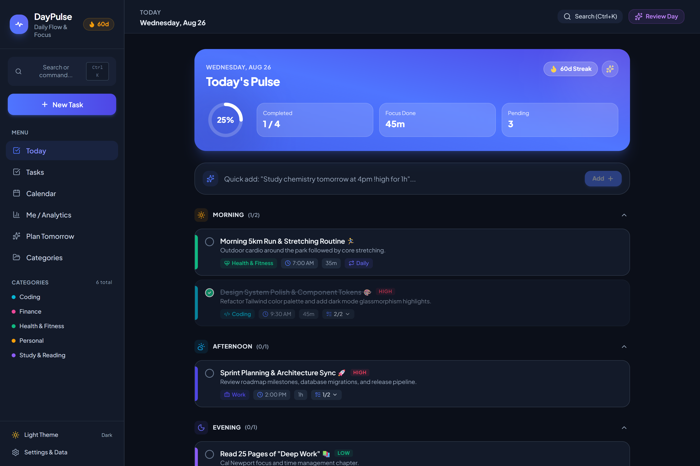
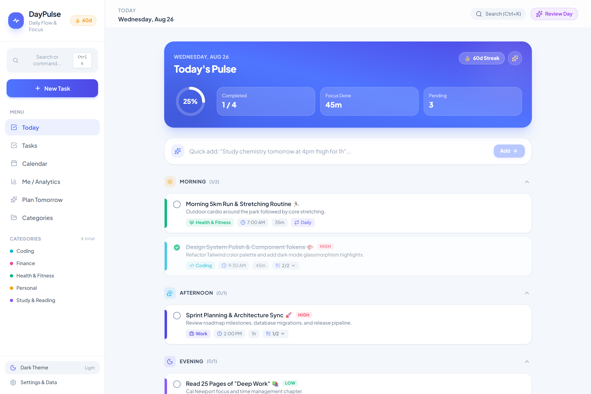
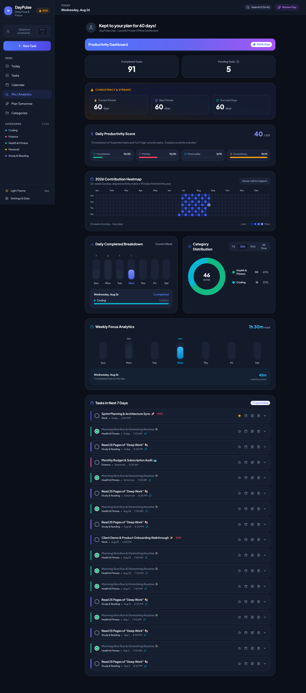
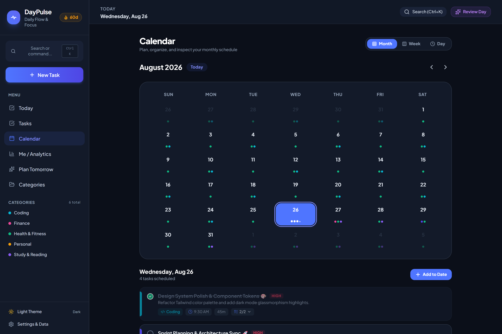
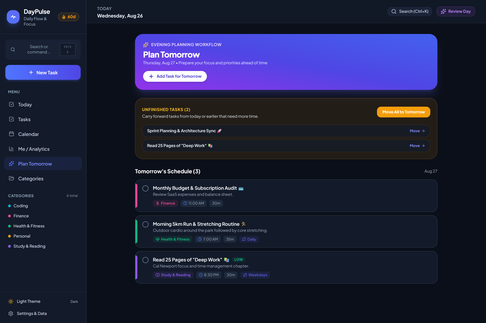
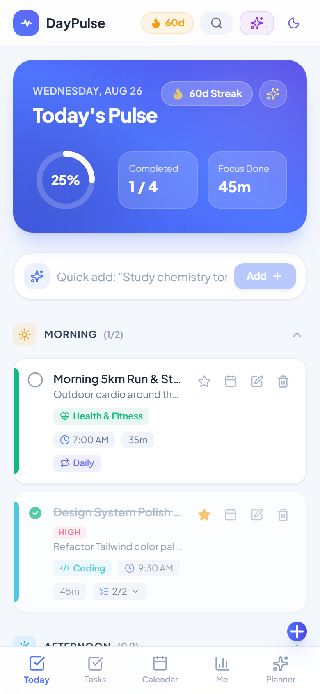

Live on-> https://daypulse.antideploy.com/

# 🌟 DayPulse — Modern Daily Planner & Habit Tracker

[](https://daypulse.antideploy.com)
[](https://flutter.dev)
[](https://dart.dev)
[](https://riverpod.dev)
[](https://pub.dev/packages/sqflite)
[](LICENSE)

**DayPulse** is a feature-rich, privacy-focused personal productivity suite available for **Mobile (Flutter)** and **Web (React 19 + TypeScript + Vite)**. It combines task management, zero-bloat recurring task synthesis, 53-week annual contribution heatmap analytics, high-priority notifications, and custom category workflows into a unified, seamless experience.

🌐 **Live Web App**: [https://daypulse.antideploy.com](https://daypulse.antideploy.com) · [Website Documentation](Website/README.md)

---

## 📸 Visual Showcase & Web Screenshots

### 1. Today Command Center (OLED Dark & Crisp Light Theme)
> Real-time progress pulse ring, Natural Language quick-add bar, and time-block slotting (*Morning, Afternoon, Evening*).

| Dark Theme (OLED) | Light Theme |
| :---: | :---: |
|  |  |

---

### 2. "Me" Productivity Hub & 53-Week Annual Contribution Heatmap
> 53-week Sunday-aligned activity matrix, Category Donut chart, Weekly Focus time analytics, and compact expandable upcoming tasks.

<div align="center">
  
</div>

---

### 3. 7-Column Calendar Matrix & Task Management
> Seamless navigation between Month, Week, and Day views with category indicators and quick filtering.

| 7-Column Calendar Month Matrix | Filtered Task Hub |
| :---: | :---: |
|  |  |

---

### 4. Evening Review (Plan Tomorrow) & Mobile PWA Responsive View
> Wrap up daily accomplishments, clear backlogs, and set top 3 priorities for tomorrow on desktop and mobile.

| Evening Review & Tomorrow Planner | Mobile PWA Responsive View |
| :---: | :---: |
|  |  |

---

## ✨ Key Features

### 📅 Calendar & Timeline Suite
- **7-Column Month Matrix**: Clean calendar grid with trailing/leading day styling, task indicator dots, and solid circular badge highlight for the selected day.
- **Dynamic View Modes**: Toggle between **Month Grid**, **Week Timeline**, and **Day Timeline** views.
- **Multifaceted Filtering**: Filter tasks across views by **Category**, **Priority**, and **Status** (Pending / Completed).
- **Single Action System**: Floating Action Button automatically presets the selected calendar date.

### 🔁 Zero-Bloat Recurring Tasks Engine
- **Dynamic Occurrence Generation**: Recurrence patterns (`Daily`, `Weekdays`, `Weekly`, `Monthly`, `Custom`) are synthesized on-the-fly without pre-populating future database rows.
- **Occurrence-Level Independence**: Complete, skip, or edit individual occurrences without mutating historical logs or future schedules.
- **Flexible End Conditions**: Support for `Never`, `On Date`, or `After X Occurrences`.

### 📊 "Me" Productivity Dashboard & Heatmap
- **53-Week Annual Contribution Grid**: Sunday-aligned GitHub-style contribution heatmap with month labels (`Jan` – `Dec`) and auto-scroll to current week.
- **Interactive Day Inspector**: Tap or hover on any weekday bar or heatmap cell to view percentage breakdown and category distribution.
- **Donut Chart Categorization**: Real-time completed task category breakdown with interactive touch tooltips, supporting custom categories and General tasks.
- **Daily Focus Analytics**: Dynamic weekday focus tracking with automated duration aggregation.

### 🎯 Hierarchical Subtasks & Task Management
- **Atomic Subtask Creation**: Create subtasks directly in quick-add sheets and full editors with automatic pending text capture.
- **Clean Task Hierarchy**: Subtasks are decoupled from top-level pending counts on overview dashboards.
- **Bidirectional Completion Sync**: Completing all subtasks marks the parent complete; unchecking any subtask reopens the parent.

### 🔔 High-Priority Notifications & Exact Alarms
- **Start Time Alerts**: Automatic reminder scheduling at exact start times or with custom offsets (`5m`, `10m`, `30m`, `1h`).
- **14-Day Lookahead**: Recurring tasks automatically maintain scheduled alarms for upcoming occurrences across the next 2 weeks.
- **Android 13/14+ Compatibility**: Runtime `POST_NOTIFICATIONS` and `SCHEDULE_EXACT_ALARM` permissions with fallback to inexact idle alarms.

### 🎨 Custom Categories & Palette
- **Integrated Category Creator**: Built-in editor with 16 category icons and 12 hex color swatches.
- **Safe Deletion**: Delete categories with automatic reassignment of tasks to "General".

---

## 🏗️ Architecture & Technology Stack

```
lib/
├── core/
│   ├── database/        # SQLite migration v3, table definitions, DAO
│   ├── notifications/   # High-priority alert channels & exact alarms
│   ├── preferences/     # User preferences & theme persistence
│   ├── routing/         # GoRouter navigation shell & route declarations
│   ├── theme/           # Dark/Light theme design tokens & palettes
│   └── utilities/       # Date calculations, natural language parsers
└── features/
    ├── calendar/        # Month grid, week & day timeline widgets, filter state
    ├── categories/      # Category models, repositories, and editor sheets
    ├── onboarding/      # Welcome flow and permission triggers
    ├── planner/         # Tomorrow planner & evening review workflows
    ├── progress/        # 53-week heatmap, focus table, category donut charts
    ├── settings/        # App configuration, backup & restore
    ├── tasks/           # Task models, recurrence engine, cards & sheets
    └── today/           # Time-slot sections, quick add, daily overview
```

- **State Management**: [Flutter Riverpod 2.x](https://riverpod.dev)
- **Local Persistence**: [Sqflite](https://pub.dev/packages/sqflite) (SQLite v3) + [SharedPreferences](https://pub.dev/packages/shared_preferences)
- **Navigation**: [GoRouter](https://pub.dev/packages/go_router)
- **Charts & Visualization**: [fl_chart](https://pub.dev/packages/fl_chart)
- **Notifications**: [flutter_local_notifications](https://pub.dev/packages/flutter_local_notifications) + [timezone](https://pub.dev/packages/timezone)

---

## 🚀 Getting Started

### Prerequisites
- [Flutter SDK](https://flutter.dev/docs/get-started/install) `^3.22.0` or higher
- [Android Studio](https://developer.android.com/studio) / Xcode for iOS
- Java 17+

### Installation & Run

1. **Clone the repository**:
   ```bash
   git clone https://github.com/<your-username>/daypulse.git
   cd daypulse
   ```

2. **Install dependencies**:
   ```bash
   flutter pub get
   ```

3. **Run unit test suite**:
   ```bash
   flutter test
   ```

4. **Launch the application**:
   ```bash
   flutter run
   ```

5. **Build release APK**:
   ```bash
   flutter build apk --split-per-abi --release
   ```

---

## 🧪 Automated Testing

DayPulse includes comprehensive unit tests verifying parser logic, productivity scores, model serialization, subtask hierarchies, and streak calculation integrity:

```bash
flutter test
# Output: 23/23 tests passed!
```

---

## 📄 License

This project is licensed under the MIT License - see the [LICENSE](LICENSE) file for details.
